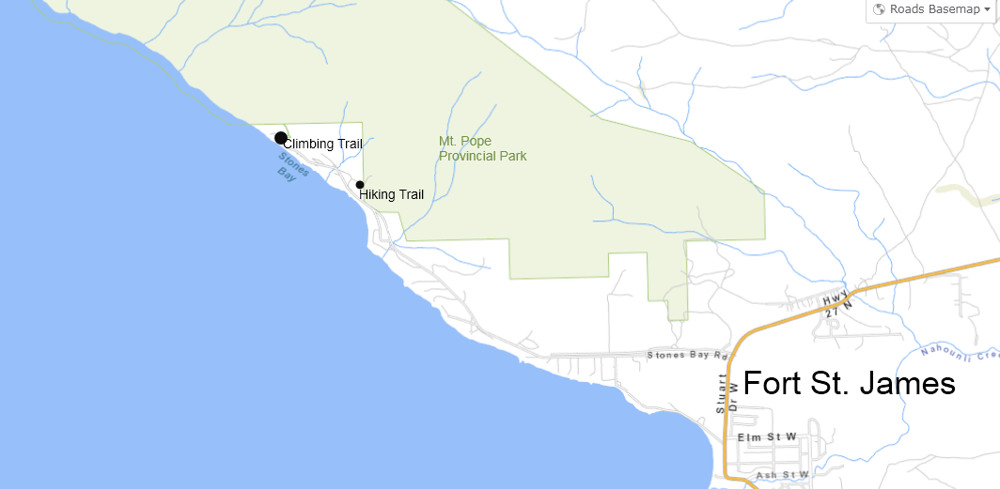
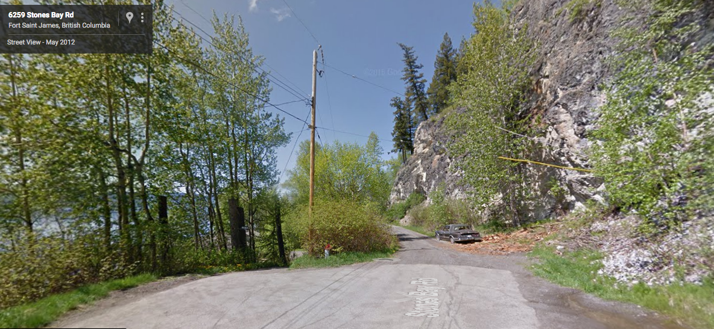
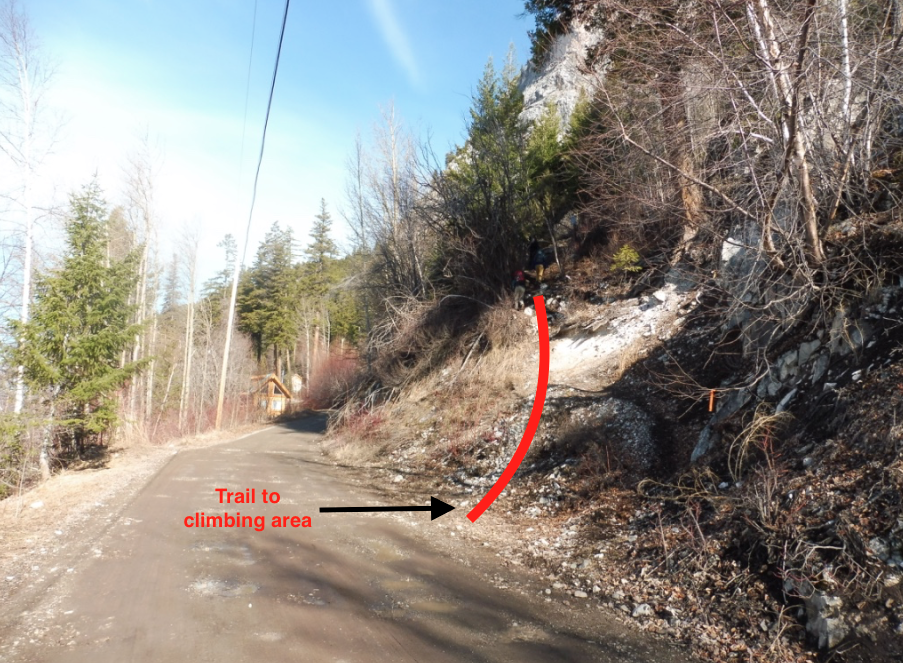

## Resources

- [7th Heaven](/public/resources/Mt.-Pope-Seventh-Heaven-Slab-Area.pdf)
- [Armegeddon](/public/resources/Mt.-Pope-Armageddon.pdf)
- [Forbidden Fruit](/public/resources/Mt.Pope-Forbidden-Fruit.pdf)
- [Hells Bells](/public/resources/Hells-Bells.pdf)
- [T-Cave / Area 51](/public/resources/T-CaveArea-51.pdf)
- [Updated Mt. Pope Climbs](/public/resources/Updated-guide-to-Mount-Pope-Rock-Climbs.pdf)

## Getting There

1. From Prince George, begin your journey by driving west to Fort St. James. Take Highway 16 West to Vanderhoof and then switch to Highway 27, which will lead you to Fort Saint James.

2. Once in Fort St. James, continue along Highway 27, and make a left turn onto Stone Bay Rd., heading towards Mt. Pope Provincial Park.

3. Keep driving on Stone Bay Rd. until you reach the conclusion of the public road, which is approximately 5.3 kilometers from your starting point (refer to Image B).

4. On the left side, about 100-200 meters down the private road, you'll find the main trail (refer to Image C).

5. Follow the trail and the posted hiking signs; you'll start encountering climbing crags on your right.

