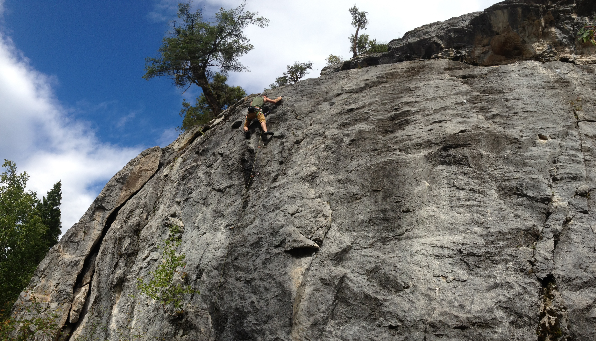

An updated guide (2015) for climbs in the Willams Lake area can be found at Red Shreds in Williams Lake, BC.

Also check out William Lake Climbing Association for updates on climbing at Esler.

## From Prince George

1. Drive south on Hwy 97 to Williams Lake (~240km)
1. At the Hwy 20/97 junction continue straight through the lights onto Hwy 20
1. In about 4.1km turn right on Hodgson Rd.
1. In about 3.6 km turn right on a dirt road (see image A1 & A2)
1. From the dirt road set the odometer at 0
1. Continue on gravel road for about 1.4 km and turn left (it will be past the second pond, see image B)
1. Continue on main dirt road, when odometer reads 3.7km curve left at fork.
1. The road will end at a grassy opening the odometer will read about 6.3km, crag is on the left (image C).
