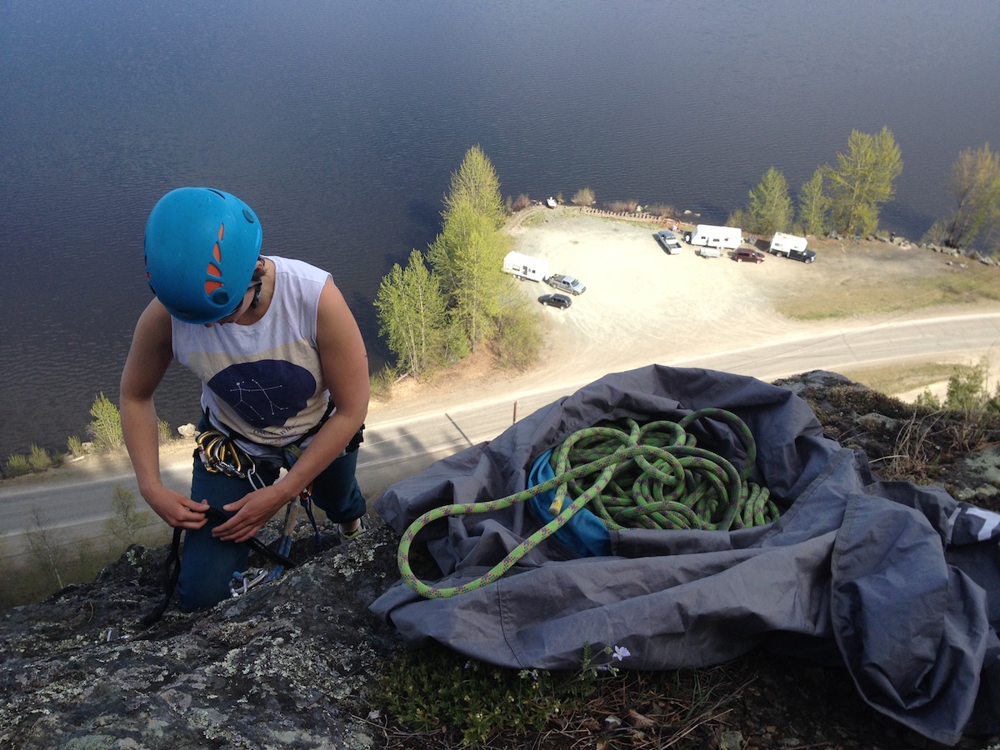
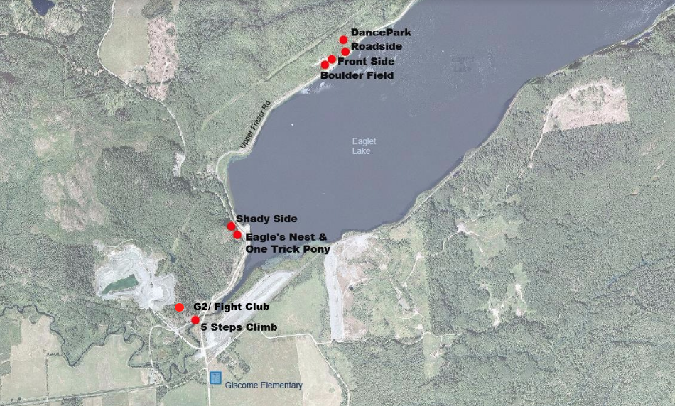
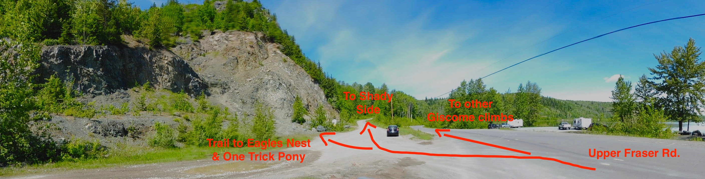

## From Prince George

1. Head towards Jasper on Hwy 16 East.
1. Turn left on Upper Fraser road (~13km from PG).
1. Continue on Upper Fraser road for about 23km (Giscome Elementary will be on your right).

### To 5 Steps Climb

1. Cross the railroad tracks and turn left on the gravel road (see Image B),
1. Take the first right on the gravel road,
1. In about 200 meters the climb will be on the left.

### To Eagles Nest, One Trick Pony & Shady Side

1. Cross the railroad track and continue on Upper Fraser road for about 1km.
1. Turn left on the gravel road, you will see Eaglet Lake and a pull out on the right
1. Park on the gravel road (make sure you leave space for cars to use the road).

_Trail to Eagles Nest and One Trick Pony begins on the left (See Photos below)_

_Trail to Shady Side is about 200 meters down the road on the left (See Photos below)_

_For Shady Side:_ If you pass a yellow sign (on the right) with the number '10' on it OR if the road begins to gradually go down a hill you have missed the trailhead.

### To Boulder Field, Front Side, Roadside and Dance Park

1. Cross the railroad track and continue on Upper Fraser road for about 2.6km
1. There will be a pullout on your right, park here (See below image). On your left there will be a trailhead to the Boulder Field, Front Side and Dance Park. (See Photos below).
1. Continue through the Boulder Field and follow the path through the trees to access the top of Front Bluffs. The anchors to Front Bluffs will be on your right. You may also access the base of Front Bluffs by scrambling from the road (it's pretty loose rock).
1. For Dance Park, pass the anchors to Front Bluffs and continue on the trail. Dance Park will appear in front of you on the left.
1. Roadside Climbs are right beside Upper Fraser road. From the pullout continune on Upper Fraser road for about 200 meters to see Roadside Climbs (on the left).

