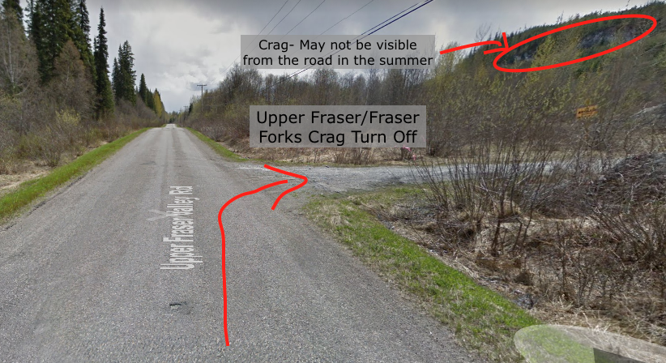
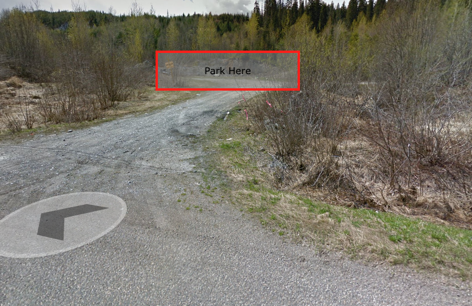
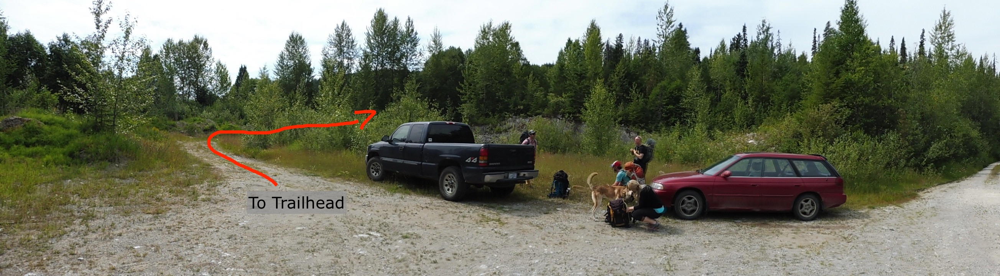

## Getting There

1. Begin your journey by heading east from Prince George towards Jasper on Highway 16. After approximately 13 kilometers from Prince George, make a left turn onto Upper Fraser Road.

2. Proceed along Upper Fraser Road for approximately 58 kilometers, which will take you about 5 kilometers beyond the town of Upper Fraser.

3. Make a right turn onto an unnamed road, as shown in Image A.

4. Once you've reached your destination, park your vehicle and take a walk towards the southeast to reach the trailhead, as indicated in Images B and C.

## Note

Routes are currently mossy and require cleaning, bring a brush and remember your helmet as there will be loose rock.

Lots of route development potential!

