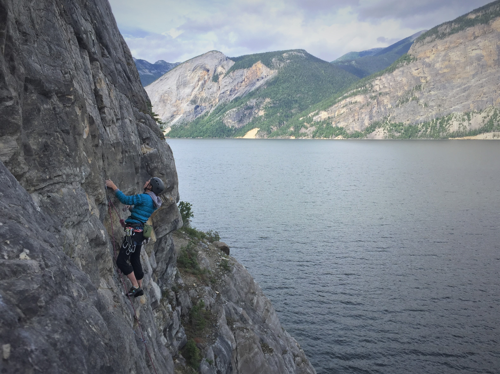

If you are in the Mackenzie area (and have a boat) you should check out Williston Lake. It requires a boat and driving down seldom-graded forestry service roads but the climbs look amazing. Be ready to have an adventure!

For all the info you need about this area download this [Guide Book](/resources/Williston-Lake-GuideBookFinal2021.pdf) by Michelle and Andrew Neis.

Note: This area still being developed and we will try to keep the link updated.
